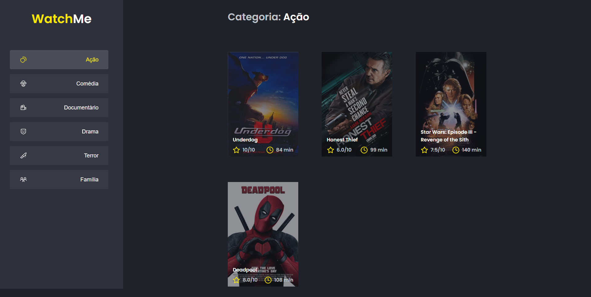

# Componetizando a Aplicação

  [](https://github.com/gi-carnaval)
  [](#)
  [](https://github.com/gi-carnaval/NextPodcast/stargazers)

<div align="center">
  
  ### Tela inicial
  
  
  <br/>
  
## 🧪 Tecnologias

Este projeto foi desenvolvido usando as seguintes tenologias:

- [Next.js](https://nextjs.org/)
- [React](https://reactjs.org)
- [TypeScript](https://www.typescriptlang.org/)

## 🚀 Iniciando

Clone o projeto e acesse a pasta:

```bash
$ git clone https://github.com/gi-carnaval/NextPodcast.git && cd NextPodcast
```

Siga os passos abaixo:
```bash
# Install the dependencies
$ yarn

# Run the JSON server
$ yarn server

# Start the project
$ yarn dev
```

## 💻 Projeto

[Podcastr](https://podcastr-nlw.vercel.app/) para te trazer mais perto do melhor da tecnologia! 

Este foi o segundo desafio desenvolvido no curso **[Ignite]**, trilha de React.

## 📝 Licença

Este projeto é licenciado pela MIT License.


---

<p align="center">Feito por Giovani Carnaval</p>

